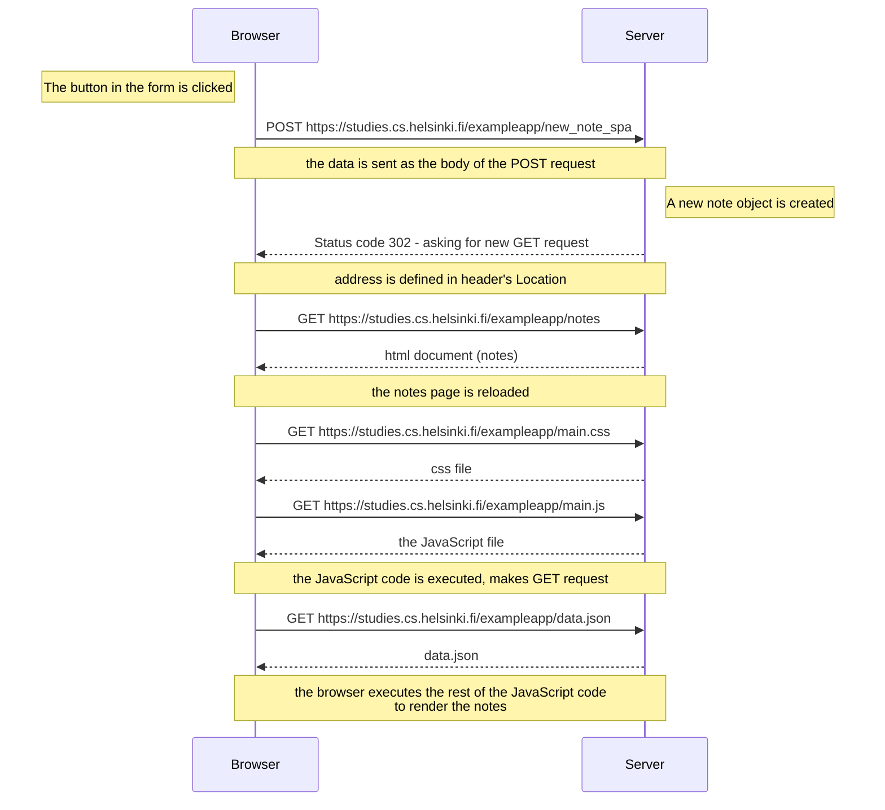

```mermaid
sequenceDiagram
Note left of Browser: The button in the form is clicked
Browser->>Server: POST https://studies.cs.helsinki.fi/exampleapp/new_note_spa
Note over Browser,Server: the data is sent as the body of the POST request
Note right of Server: A new note object is created
Server-->>Browser: Status code 302 - asking for new GET request
Note over Server,Browser: address is defined in header's Location
Browser->>Server: GET https://studies.cs.helsinki.fi/exampleapp/notes
Server-->>Browser: html document (notes)
Note over Server,Browser: the notes page is reloaded
Browser->>Server: GET https://studies.cs.helsinki.fi/exampleapp/main.css
Server-->>Browser: css file
Browser->>Server: GET https://studies.cs.helsinki.fi/exampleapp/main.js
Server-->>Browser: the JavaScript file
Note over Server,Browser: the JavaScript code is executed, makes GET request
Browser->>Server: GET https://studies.cs.helsinki.fi/exampleapp/data.json
Server-->>Browser: data.json
Note over Server,Browser: the browser executes the rest of the JavaScript code<br/>to render the notes
```
