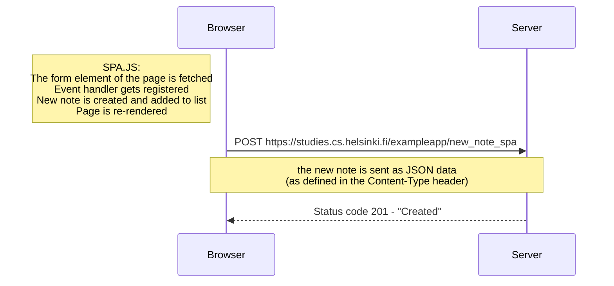

```mermaid
sequenceDiagram
Note left of Browser: SPA.JS:<br/>The form element of the page is fetched<br/>Event handler gets registered<br/>New note is created and added to list<br/>Page is re-rendered 
Browser->>Server: POST https://studies.cs.helsinki.fi/exampleapp/new_note_spa
Note over Browser,Server: the new note is sent as JSON data<br/>(as defined in the Content-Type header)
Server-->>Browser: Status code 201 - "Created"
```
