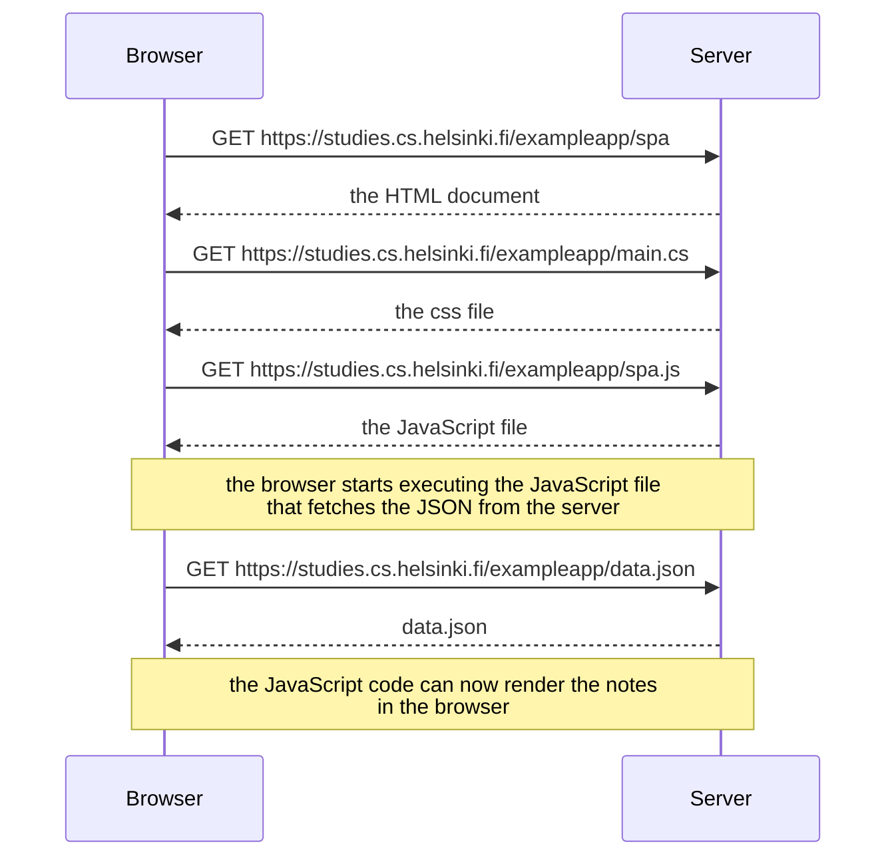

```mermaid
sequenceDiagram
Browser->>Server: GET https://studies.cs.helsinki.fi/exampleapp/spa
Server-->>Browser: the HTML document
Browser->>Server: GET https://studies.cs.helsinki.fi/exampleapp/main.cs
Server-->>Browser: the css file
Browser->>Server: GET https://studies.cs.helsinki.fi/exampleapp/spa.js
Server-->>Browser: the JavaScript file
Note over Server,Browser: the browser starts executing the JavaScript file<br/>that fetches the JSON from the server
Browser->>Server: GET https://studies.cs.helsinki.fi/exampleapp/data.json
Server-->>Browser: data.json
Note over Server,Browser: the JavaScript code can now render the notes<br/>in the browser
```
